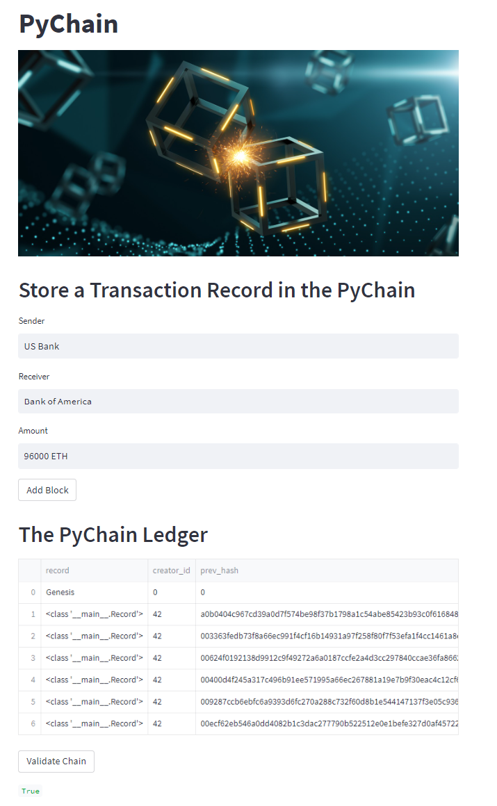

# Challenge Overview
The task for this project was to act as the lead developer for one of the world's largest bacnk to build a blockchain-based ledger system, complete with a user-friendly web interface. This ledger will allow partner banks to conduct financial transactions (that is, to transfer money between senders and receivers) and to verify the integrity of the data in the ledger.

### *Package Requirements and Versions*

`pip install x` ; where 'x' is the package listed below:
* `python == 3.7.13+` 
* `pandas == 1.3.5+`
* `streamlit == 1.13.0+`
  
  
### *Files Navigation*

Images: Contains the .png image used for this README
  pychain.py: Contains the project code

## Streamlit Overview

 

Streamlit is an open-source Python library that makes it easy for data scientists and machine learning engineers to create and share custom web apps. Streamlit's power and ease of use make it possible to build and deploy powerful data apps in just a few minutes.

As pictured above, streamlit was used to create the front end of this project. It allows for user inputs and records the data on the pychain using the "Add Block" button. Streamlit's *text_input*, *write*, and *markdown* methods were the most used for the creation of this ledger, allowing for the primary inputs (sender, receiver, and amount) to be recorded. 