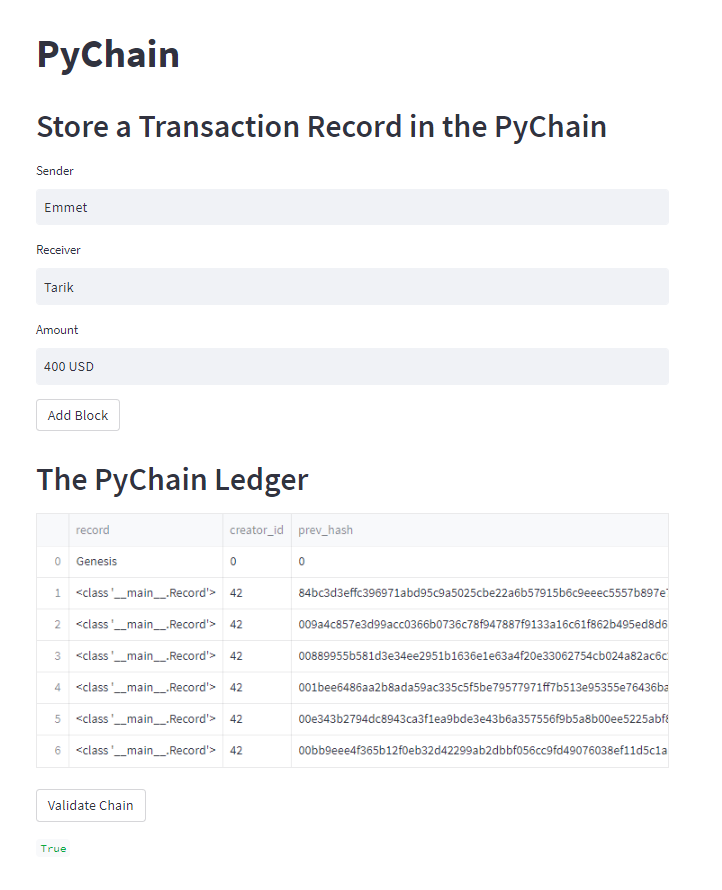

# Module 18 Challenge

## Challenge Overview

The task was to build a blockchain-based ledger system, complete with a user-friendly web interface. This ledger allows partner banks to conduct financial transactions (that is, to transfer money between senders and receivers) and to verify the integrity of the data in the ledger.

## Streamlit Overview

 

Streamlit is an open-source Python library that makes it easy for users to create and share custom web applications for machine learning and data science. Streamlit's API also allows users to visualize, mutate, and share data. 

For this challenge, streamit was used specifically to complete and record transactions on the PyChain Ledger. The ledger is interactive; allowing new blocks to be added for "Sender", "Receiver", and "Amount" inputs. There is also a feature that allows for validating the chain.

The streamlit library consists of several methods that are useful for applications like this one. Those use most prevelantly for this assigment were the "write", "text_input", and "markdown" methods. 

The PNG above shows the record of the previous six transactions on this particular chain, as well as the most recent user inputs. 